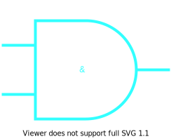

<h1 class="aqua"> A is for AND</h1>

<h2 class="orchid"> AND in boolean logic means both inputs have to be true</h2>

In most programming languages **AND** is shown by using two ampersands like this: `&&`. The computer will check both sides to make sure they are true.
