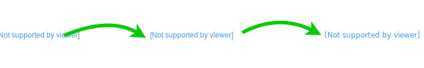

# C is for Compiler

## A **compiler** takes human readable code and turns it into something the computer can understand

**Compilers** usually have several steps. They will convert code to a special form that can be linked together before turning it into [binary](./B.md).
