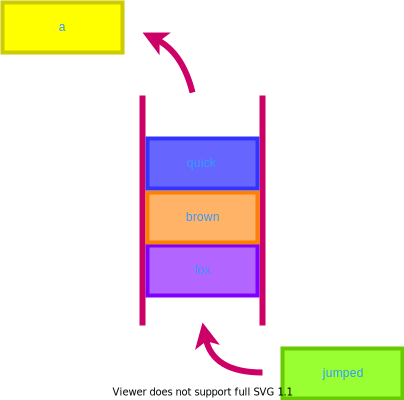

# Q is for Queue

## A queue is a group of things that sit in a row.

With a **queue**, you can only add new things to the back and take things off the front. **Queues** help to keep things in order.
