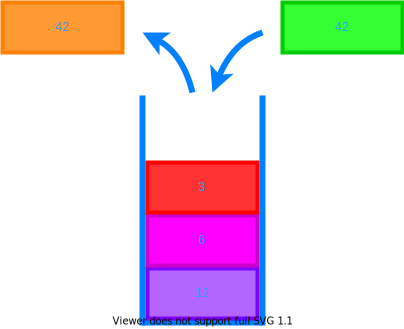

# S is for Stack

## A stack is a set of things that sit on top of each other.

With a **stack**, you can only add or remove things from the top. A **stack** can be used for things like undoing actions or reversing order.
